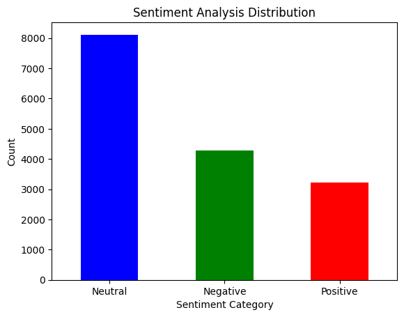
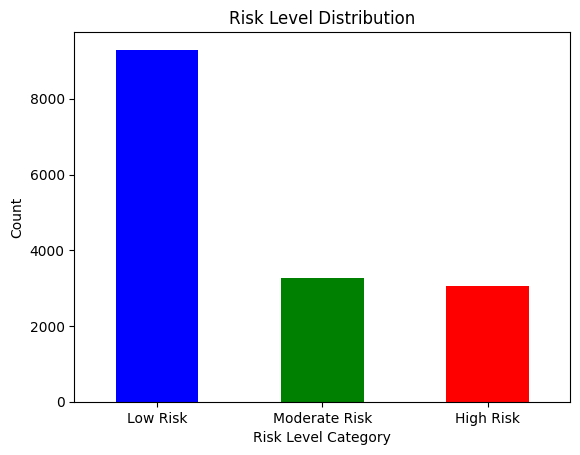
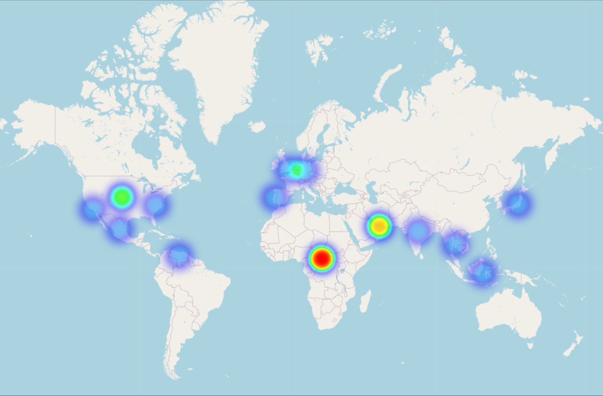
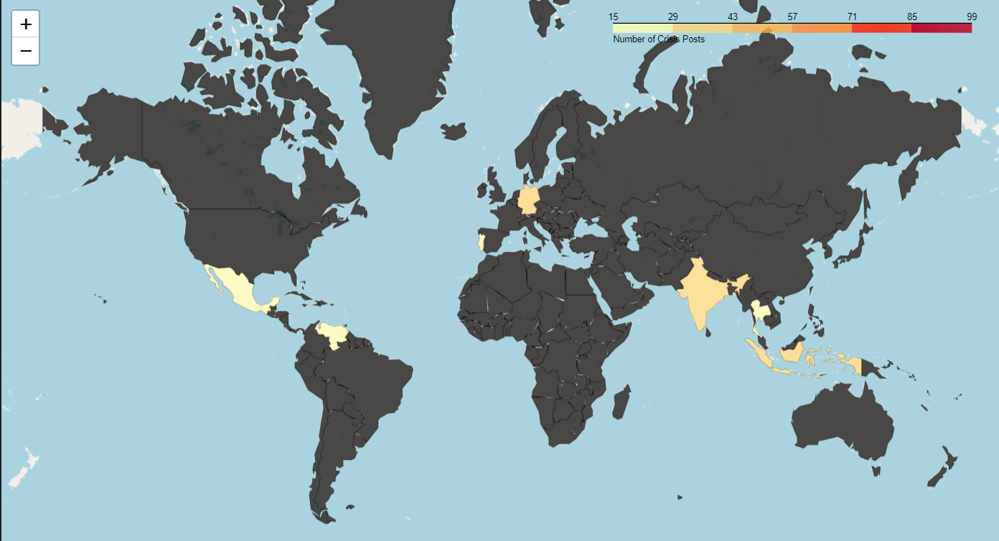

# Mental Health Crisis Detection from Social Media

## 📌 Project Overview
This project aims to analyze social media posts from Twitter/X and Reddit to detect mental health distress, substance use, and suicidality. It consists of three key tasks:

1. **Data Collection & Preprocessing**
2. **Sentiment & Crisis Risk Classification**
3. **Geolocation & Crisis Mapping**

## 🔹 Task 1: Data Collection & Preprocessing
**Goal:** Retrieve relevant posts based on mental health keywords and store them in structured format.

### 🔹 Steps:
1. **Extract posts** from Reddit using their respective APIs.
2. **Filter posts** based on a predefined list of keywords (e.g., “depressed,” “addiction help,” “suicidal”).
3. **Store relevant post details** (Post ID, Timestamp, Content, Engagement Metrics) in CSV.
4. **Preprocess text**: Remove stopwords, emojis, special characters for NLP tasks.

## 🔹 Task 2: Sentiment & Crisis Risk Classification
**Goal:** Identify sentiment and classify posts into crisis risk levels.

### 🔹 Steps:
1. **Apply Sentiment Analysis**:
- **TextBlob** for sentiment classification (Positive, Neutral, Negative).

2. **Detect High-Risk Terms**:
   -  **Word Embeddings (BERT)** to find crisis-related phrases.
3. **Categorize Posts** into Risk Levels:
   - **High-Risk:** Direct crisis language (e.g., “I don’t want to be here anymore”).
   - **Moderate Concern:** Seeking help (e.g., “I feel lost lately”).
   - **Low Concern:** General mental health discussions.

## 🔹 Task 3: Crisis Geolocation & Mapping
**Goal:** Identify locations with high crisis discussions and visualize patterns.

 **Generate Heatmaps**:
  [Heatmap](vis/final_heatmap.html)
 

 
 **Generate Choropleth**:
  [Choroplath](vis/final_choropleth.html)
 

